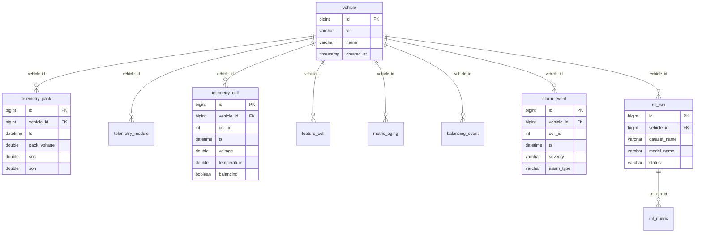

# Viewing schema / tables / ERD for aiml-bms (MySQL)

## 1. Schema files in repo

| Location | Description |
|----------|-------------|
| `db/DB_SCHEMA_MYSQL.sql` | Main MySQL schema (vehicle, telemetry_*, feature_cell, alarm_event, ml_run, etc.) |
| `backend/database/schema_mysql.sql` | Backend DB schema (may mirror or extend above) |
| `bms-ai-suite/db/mysql/schema.sql` | v2 schema (packs, cells, telemetry_*, alarms, model_runs, etc.) |

## 2. View in MySQL (command line)

```bash
# Connect (use your DB name and password from .env)
mysql -u root -p

# Then in MySQL:
SHOW DATABASES;
USE your_database_name;   -- e.g. the DB name from your backend config

SHOW TABLES;

# Single table structure
DESCRIBE vehicle;
DESCRIBE telemetry_pack;
SHOW CREATE TABLE telemetry_cell;

# List all tables in current database
SELECT TABLE_NAME FROM INFORMATION_SCHEMA.TABLES
WHERE TABLE_SCHEMA = DATABASE()
ORDER BY TABLE_NAME;
```

## 3. ERD (Entity Relationship Diagram)

### Option A: MySQL Workbench (recommended for ERD)

1. Install [MySQL Workbench](https://dev.mysql.com/downloads/workbench/).
2. Connect to your MySQL server (host, user, password from `.env`).
3. **Database → Reverse Engineer** → select your database → Next through the wizard.
4. Workbench generates an ER diagram from the live database.

### Option B: Mermaid ERD (from main schema)

Paste the block below into [Mermaid Live](https://mermaid.live/) or any Markdown viewer that supports Mermaid to see the diagram.



## 4. Other GUI tools

- **Adminer** (single PHP file): if you run it via Docker or XAMPP, open the DB and browse tables.
- **DBeaver**: connect to MySQL → expand database → Tables; right‑click table → View Diagram.
- **HeidiSQL** (Windows): connect → select database → see tables and “Create script” for DDL.

## 5. Quick reference: main tables (DB_SCHEMA_MYSQL.sql)

| Table | Purpose |
|-------|---------|
| `vehicle` | Vehicles (VIN, name) |
| `telemetry_pack` | Pack-level time series (voltage, current, SOC, SOH, temp) |
| `telemetry_module` | Module-level metrics |
| `telemetry_cell` | Cell-level (voltage, temp, SOC, balancing) |
| `feature_cell` | Engineered features (v_mean, t_std, etc.) |
| `metric_aging` | Aging / SOH proxies |
| `balancing_event` | Balancing on/off events |
| `alarm_event` | Alarms (severity, type, threshold) |
| `ml_run` | ML training runs |
| `ml_metric` | Metrics per run |
