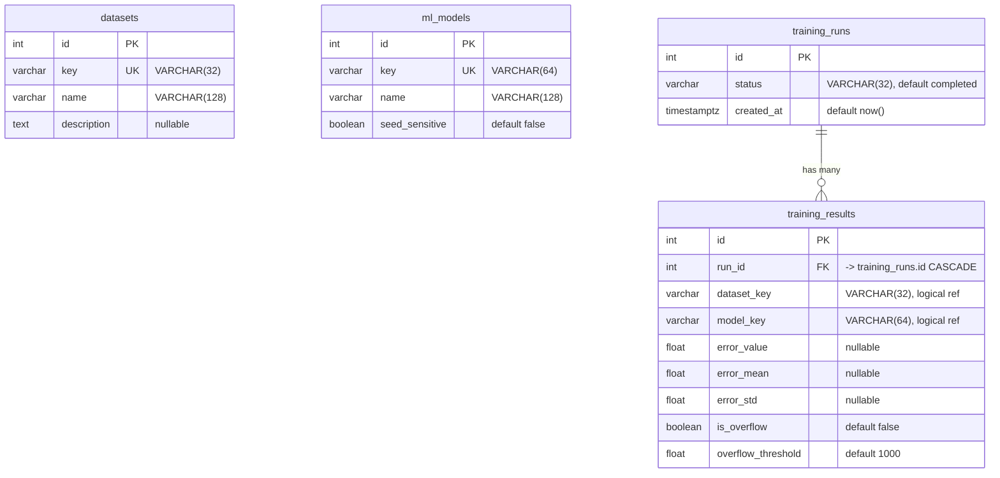

# Entity Relationship Diagram – AIML-BMS Database

PostgreSQL schema for datasets, ML models, training runs, and results.

## ASCII sketch

```
┌─────────────────┐     ┌─────────────────┐
│    datasets      │     │    ml_models    │
├─────────────────┤     ├─────────────────┤
│ id (PK)          │     │ id (PK)          │
│ key (UK)         │     │ key (UK)        │
│ name             │     │ name            │
│ description      │     │ seed_sensitive  │
└────────┬─────────┘     └────────┬────────┘
         │                        │
         │   (logical refs)        │
         │                        │
         ▼                        ▼
┌─────────────────────────────────────────┐
│           training_runs                  │
├─────────────────────────────────────────┤
│ id (PK)                                  │
│ status                                   │
│ created_at                               │
└─────────────────────┬───────────────────┘
                      │ 1
                      │
                      │ has many
                      │
                      ▼ n
┌─────────────────────────────────────────┐
│          training_results                │
├─────────────────────────────────────────┤
│ id (PK)                                  │
│ run_id (FK → training_runs) CASCADE      │
│ dataset_key  (ref datasets.key)          │
│ model_key    (ref ml_models.key)         │
│ error_value, error_mean, error_std       │
│ is_overflow, overflow_threshold          │
└─────────────────────────────────────────┘
```

## ERD (Mermaid)



## Table summary

| Table              | Purpose |
|--------------------|--------|
| **datasets**       | Dataset metadata (key, name, description). Keys used in comparison tables (e.g. MATR, HUST). |
| **ml_models**      | Model types (key, name, seed_sensitive). Keys used in comparison tables (e.g. LSTM, XGBoost). |
| **training_runs**   | One row per training/comparison job. Groups a set of results. |
| **training_results** | One row per (run, dataset, model): error_value / error_mean, error_std, overflow flags. FK to `training_runs`. |

## Relationships

- **training_runs → training_results**: One-to-many. Deleting a run deletes its results (CASCADE).
- **training_results.dataset_key** and **training_results.model_key**: Denormalized keys; no FK to `datasets`/`ml_models` (allows keys from external/CSV sources).

## Create database and tables

1. Create DB and user: see [backend/database/README.md](../backend/database/README.md).
2. Create tables: run `backend/database/schema.sql` with `psql`, or from `backend/`:  
   `python -m app.db.create_tables`
